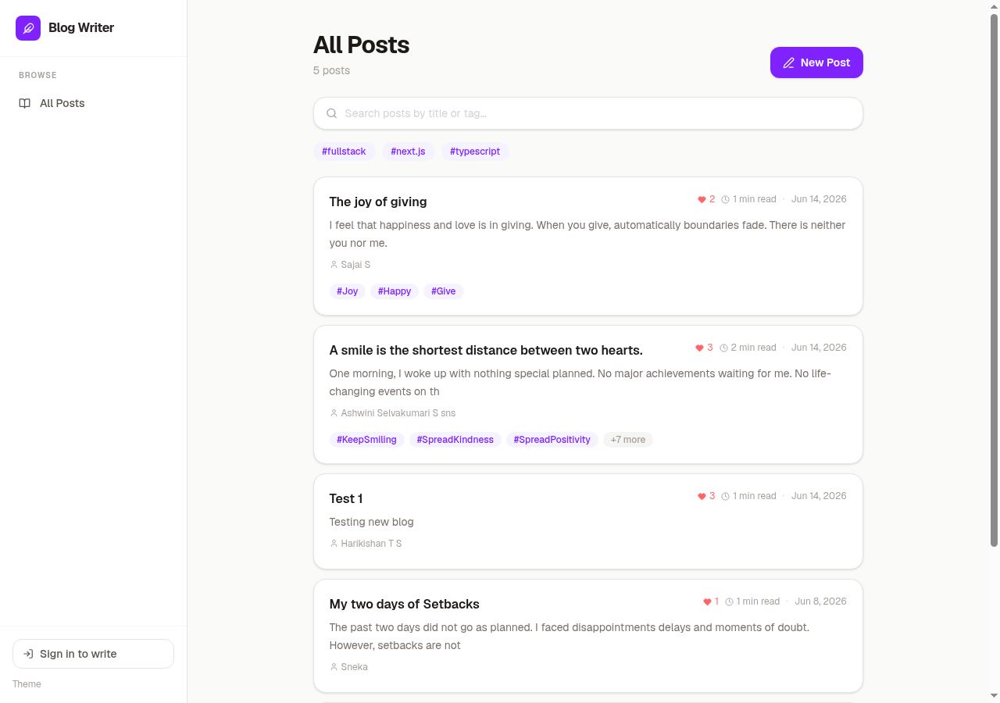

# Blog Writer

A full-stack blog writing application built from scratch with Next.js 16, TypeScript, Tailwind CSS v4, Prisma v7, and Auth.js v5. Deployed on Vercel with Neon PostgreSQL.

**Live:** [blog-writing-app-ashy.vercel.app](https://blog-writing-app-ashy.vercel.app)



## Features

| Feature | Description |
|---|---|
| Authentication | Email/password (bcrypt) + Google OAuth. JWT sessions. Route protection. |
| Rich Text Editor | TipTap editor with auto-save to localStorage every 1.5s |
| Dark Mode | Class-based dark mode via next-themes with Tailwind v4 custom variant |
| Responsive Design | Desktop sidebar + mobile hamburger nav with slide-in drawer |
| Tag System | 3 default filter tags on home page. Post cards capped at 3 tags with "+N more" |
| Search | Search posts by title or tag with search highlighting |
| Pagination | 6 posts per page with page navigation |
| Like Button | Atomic DB increment with localStorage deduplication |
| Bookmarks | Save posts to read later (localStorage). Dedicated /bookmarks page |
| Post Views | View counter (1 per session) shown on cards and post header |
| Share Button | Copy link, Post on X, native Web Share API on mobile |
| Related Posts | Tag-based matching, up to 3 related posts per post |
| Reading Progress Bar | Fixed violet bar tracking scroll position |
| Reading Time | Word count / 200 wpm estimate on cards and post header |
| Table of Contents | Auto-generated collapsible TOC from post headings |
| Copy Code Blocks | Hover-to-show Copy button on code blocks in posts |
| Author Profiles | Dynamic /author/[name] pages with post count |
| Profile Page | User stats: total posts, likes received, views, joined date |
| Scroll Inspiration Banner | Random writing quote on first scroll, fades after 3s |

## Tech Stack

- **Framework:** Next.js 16 (App Router, Turbopack)
- **Language:** TypeScript
- **Styling:** Tailwind CSS v4
- **Database:** Neon PostgreSQL via Prisma v7
- **Auth:** Auth.js v5 (Credentials + Google OAuth)
- **Editor:** TipTap (headless rich-text)
- **Deployment:** Vercel

## Getting Started

```bash
# Install dependencies
npm install

# Set up environment variables
cp .env.example .env
# Fill in DATABASE_URL, AUTH_SECRET, AUTH_GOOGLE_ID, AUTH_GOOGLE_SECRET

# Apply database migrations
npx prisma migrate dev --name init

# Start dev server
npm run dev
```

Open [http://localhost:3000](http://localhost:3000) in your browser.

## Project Structure

```
app/
  layout.tsx            # Root layout with sidebar, mobile nav, theme
  page.tsx              # Home page — post list, search, tag filter, pagination
  posts/
    new/page.tsx        # New post editor (TipTap)
    [id]/page.tsx       # Post view — TOC, content, like, bookmark, share
    [id]/edit/page.tsx  # Edit post
  author/[name]/page.tsx # Author profile
  bookmarks/page.tsx    # Saved posts (client-side)
  profile/page.tsx      # User stats & posts
  login/page.tsx        # Login (credentials + Google)
  register/page.tsx     # Registration
  api/
    posts/route.ts          # GET all, POST new
    posts/[id]/route.ts     # GET, PUT, DELETE
    posts/[id]/like/route.ts  # POST like
    posts/[id]/view/route.ts  # POST view increment
    auth/[...nextauth]/route.ts
    auth/register/route.ts

components/
  Editor.tsx              # TipTap rich-text editor
  PostCard.tsx            # Post list card with search highlighting
  BookmarkButton.tsx      # Toggle bookmark (localStorage)
  LikeButton.tsx          # Heart button with animation
  ViewCounter.tsx         # View count with session tracking
  ShareButton.tsx         # Copy link, Post on X, native share
  TableOfContents.tsx     # Collapsible TOC from headings
  CopyCodeBlocks.tsx      # Copy button on code blocks
  ReadingProgressBar.tsx  # Scroll-driven progress bar
  Pagination.tsx          # Page navigation
  TagFilter.tsx           # Tag filter buttons
  SearchBar.tsx           # Search input
  ThemeToggle.tsx         # Light/dark/system toggle
  ThemeProvider.tsx       # next-themes provider
  MobileNav.tsx           # Mobile hamburger + drawer
  UserMenu.tsx            # User avatar + sign out
  ContentArea.tsx         # Main wrapper + scroll banner
  ScrollInspirationBanner.tsx # Writing quote banner

lib/
  db.ts                 # Prisma client singleton
  readingTime.ts        # Reading time calculator

prisma/
  schema.prisma         # Post + User models
  migrations/           # PostgreSQL migrations
```

## Database Models

```prisma
model Post {
  id         String   @id @default(cuid())
  title      String
  content    String
  tags       String   @default("")
  authorId   String?
  authorName String?
  likes      Int      @default(0)
  views      Int      @default(0)
  createdAt  DateTime @default(now())
  updatedAt  DateTime @updatedAt
}

model User {
  id        String   @id @default(cuid())
  name      String?
  email     String   @unique
  password  String
  createdAt DateTime @default(now())
}
```

## Deployment

```bash
vercel --prod --yes --scope keerthishree-s-projects
```

Build runs `prisma migrate deploy && next build`. Environment variables managed in Vercel dashboard.

## Environment Variables

```
DATABASE_URL        # Neon PostgreSQL connection string
AUTH_SECRET         # Auth.js JWT encryption secret
AUTH_GOOGLE_ID      # Google OAuth client ID
AUTH_GOOGLE_SECRET  # Google OAuth client secret
AUTH_GITHUB_ID      # (optional) GitHub OAuth client ID
AUTH_GITHUB_SECRET  # (optional) GitHub OAuth client secret
```

## License

MIT
